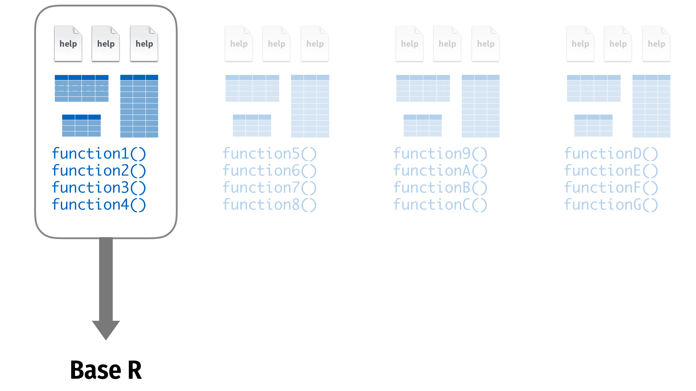
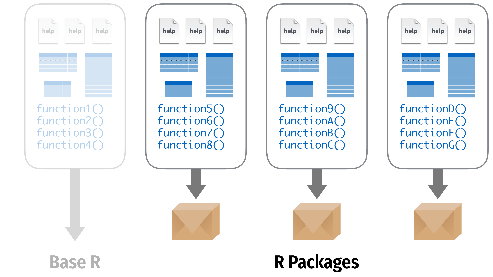
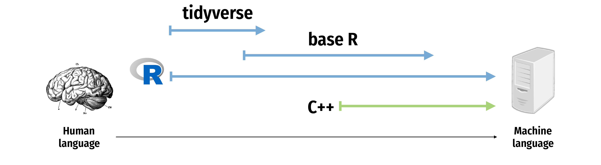
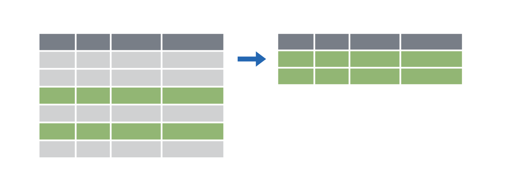
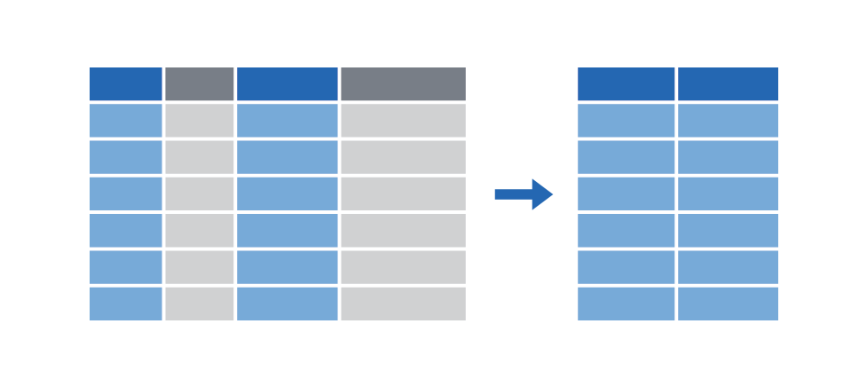
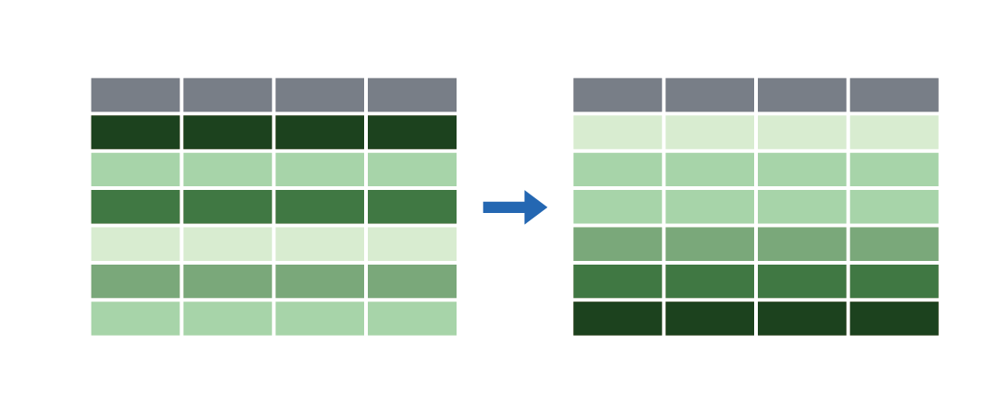
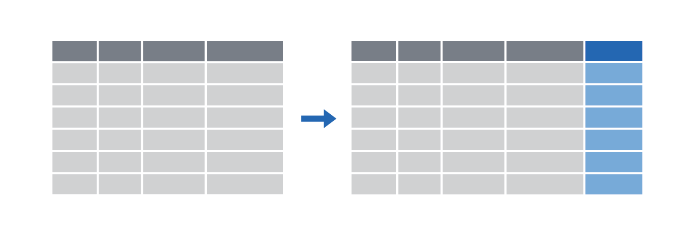
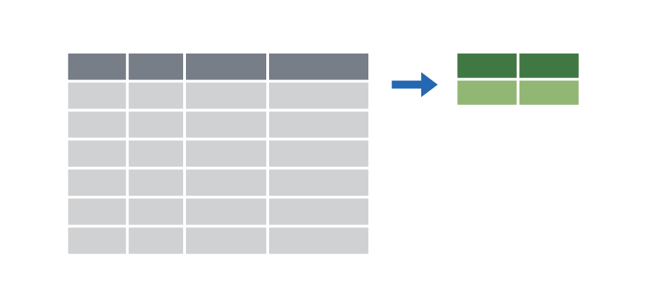

```{r}
library(tidyverse)
library(kableExtra)
```

## Overview

::::: columns
::: {.column style="font-size: smaller;"}
1.  **Data Basics**
    -   Variables
    -   Data frames
2.  **Data Wrangling in the Tidyverse**
    -   Data structure
    -   Classes
    -   Vectors
    -   Subsetting
3.  **Distributions**
    -   Summary and key takeaways
:::

::: {.column style="font-size: smaller;"}
4. **Markdown and universal writing** 
    - Office Model vs. Engineering Model
    - Excel failures
    - Markdown
5.  **Writing reports in Quarto**
    -   What is Quarto?
    -   YAML header
    -   Code chunks
    -   Text formatting
    -   Run and render your code
    -   Inline code
    -   Tables
    -   Preset themes
    -   Report parameters
:::
:::::

# Data basics

---

## Variables

A variable is ...

. . .

Some measure that can vary.

::: {style="text-align: center;"}

:::

---

## Variables

Imagine you fill out a survey about your way to school.

---

## Variables

```{r}
#| echo: false


# Create the table
data <- data.frame(
  Question = c(
    "How far do you live from the Jourdan University building?",
    "How do you get there, usually?",
    "How much time approximately does it take you to get there?",
    "What arrondissement/suburb do you live in?",
    "Compared to your classmates, how close do you think you live to University?",
    "What’s the most annoying part of your itinerary to/from university?",
    "Please indicate your level of (dis)agreement with the following statement: 'My itinerary to university is annoying.'"
  ),
  Answer_Option = c(rep(" ", times = 7)
  ),
  Variable_Name = c(rep(" ", times = 7)
  ),
  Variable_Type = c(
    " ", " ", " ",
    " ", " ",
    " ", " "
  )
  )

# Render with kableExtra and small text size
kbl(data, col.names = c("Survey Question", "Answer Options", "Variable Name", "Variable Type"),
    booktabs = TRUE, align = "l", escape = FALSE) %>%
  kable_styling(full_width = FALSE, position = "center", font_size = 20) 
```

---

## Variables

```{r}
#| echo: false


# Create the table
data <- data.frame(
  Question = c(
    "How far do you live from the Jourdan University building?",
    "How do you get there, usually?",
    "How much time approximately does it take you to get there?",
    "What arrondissement/suburb do you live in?",
    "Compared to your classmates, how close do you think you live to University?",
    "What’s the most annoying part of your itinerary to/from university?",
    "Please indicate your level of (dis)agreement with the following statement: 'My itinerary to university is annoying.'"
  ),
  Answer_Option = c(
    "Use the exact distance in km",
    "Bike, Metro, Walking, or Other",
    "less than 15 mins, between 15 and 60 mins, more than 60 mins",
    "Open-ended",
    "Closer, About the same, Further away",
    "Describe briefly",
    "1: Fully disagree – 5: Fully agree"
  ),
  Variable_Name = c(rep(" ", times = 7)
  ),
  Variable_Type = c(
    " ", " ", " ",
    " ", " ",
    " ", " "
  )
)

# Render with kableExtra and small text size
kbl(data, col.names = c("Survey Question", "Answer Options", "Variable Name", "Variable Type"),
    booktabs = TRUE, align = "l", escape = FALSE) %>%
  kable_styling(full_width = FALSE, position = "center", font_size = 20) 
```

---

## Variables

```{r}
#| echo: false


# Create the table
data <- data.frame(
  Question = c(
    "How far do you live from the Jourdan University building?",
    "How do you get there, usually?",
    "How much time approximately does it take you to get there?",
    "What arrondissement/suburb do you live in?",
    "Compared to your classmates, how close do you think you live to University?",
    "What’s the most annoying part of your itinerary to/from university?",
    "Please indicate your level of (dis)agreement with the following statement: 'My itinerary to university is annoying.'"
  ),
  Answer_Option = c(
    "Use the exact distance in km",
    "Bike, Metro, Walking, or Other",
    "less than 15 mins, between 15 and 60 mins, more than 60 mins",
    "Open-ended",
    "Closer, About the same, Further away",
    "Describe briefly",
    "1: Fully disagree – 5: Fully agree"
  ),
  Variable_Name = c(
    "Distance to school", "Mode of transportation", "Travel time",
    "Place of residence", "Relative perceived distance",
    "Object of annoyance", "Degree of annoyance"
  ),
  Variable_Type = c(
    " ", " ", " ",
    " ", " ",
    " ", " "
  )
)

# Render with kableExtra and small text size
kbl(data, col.names = c("Survey Question", "Answer Options", "Variable Name", "Variable Type"),
    booktabs = TRUE, align = "l", escape = FALSE) %>%
  kable_styling(full_width = FALSE, position = "center", font_size = 20) 
```

---

## Variables

```{r}
#| echo: false


# Create the table
data <- data.frame(
  Question = c(
    "How far do you live from the Jourdan University building?",
    "How do you get there, usually?",
    "How much time approximately does it take you to get there?",
    "What arrondissement/suburb do you live in?",
    "Compared to your classmates, how close do you think you live to University?",
    "What’s the most annoying part of your itinerary to/from university?",
    "Please indicate your level of (dis)agreement with the following statement: 'My itinerary to university is annoying.'"
  ),
  Answer_Option = c(
    "Use the exact distance in km",
    "Bike, Metro, Walking, or Other",
    "less than 15 mins, between 15 and 60 mins, more than 60 mins",
    "Open-ended",
    "Closer, About the same, Further away",
    "Describe briefly",
    "1: Fully disagree – 5: Fully agree"
  ),
  Variable_Name = c(
    "Distance to school", "Mode of transportation", "Travel time",
    "Place of residence", "Relative perceived distance",
    "Object of annoyance", "Degree of annoyance"
  ),
  Variable_Type = c(
    "Numeric", " ", " ",
    " ", " ",
    " ", " "
  )
)

# Modify the value to include HTML styling
data$Variable_Type[1] <- cell_spec(data$Variable_Type[1], extra_css = "border: 3px solid red;")

# Render with kableExtra and small text size
kbl(data, col.names = c("Survey Question", "Answer Options", "Variable Name", "Variable Type"),
    booktabs = TRUE, align = "l", escape = FALSE) %>%
  kable_styling(full_width = FALSE, position = "center", font_size = 20) 
```

---

## Variables

```{r}
#| echo: false


# Create the table
data <- data.frame(
  Question = c(
    "How far do you live from the Jourdan University building?",
    "How do you get there, usually?",
    "How much time approximately does it take you to get there?",
    "What arrondissement/suburb do you live in?",
    "Compared to your classmates, how close do you think you live to University?",
    "What’s the most annoying part of your itinerary to/from university?",
    "Please indicate your level of (dis)agreement with the following statement: 'My itinerary to university is annoying.'"
  ),
  Answer_Option = c(
    "Use the exact distance in km",
    "Bike, Metro, Walking, or Other",
    "less than 15 mins, between 15 and 60 mins, more than 60 mins",
    "Open-ended",
    "Closer, About the same, Further away",
    "Describe briefly",
    "1: Fully disagree – 5: Fully agree"
  ),
  Variable_Name = c(
    "Distance to school", "Mode of transportation", "Travel time",
    "Place of residence", "Relative perceived distance",
    "Object of annoyance", "Degree of annoyance"
  ),
  Variable_Type = c(
    "Numeric", "Nominal", " ",
    " ", " ",
    " ", " "
  )
)

# Modify the value to include HTML styling
data$Variable_Type[2] <- cell_spec(data$Variable_Type[2], extra_css = "border: 3px solid red;")

# Render with kableExtra and small text size
kbl(data, col.names = c("Survey Question", "Answer Options", "Variable Name", "Variable Type"),
    booktabs = TRUE, align = "l", escape = FALSE) %>%
  kable_styling(full_width = FALSE, position = "center", font_size = 20) 
```

---

## Variables

```{r}
#| echo: false


# Create the table
data <- data.frame(
  Question = c(
    "How far do you live from the Jourdan University building?",
    "How do you get there, usually?",
    "How much time approximately does it take you to get there?",
    "What arrondissement/suburb do you live in?",
    "Compared to your classmates, how close do you think you live to University?",
    "What’s the most annoying part of your itinerary to/from university?",
    "Please indicate your level of (dis)agreement with the following statement: 'My itinerary to university is annoying.'"
  ),
  Answer_Option = c(
    "Use the exact distance in km",
    "Bike, Metro, Walking, or Other",
    "less than 15 mins, between 15 and 60 mins, more than 60 mins",
    "Open-ended",
    "Closer, About the same, Further away",
    "Describe briefly",
    "1: Fully disagree – 5: Fully agree"
  ),
  Variable_Name = c(
    "Distance to school", "Mode of transportation", "Travel time",
    "Place of residence", "Relative perceived distance",
    "Object of annoyance", "Degree of annoyance"
  ),
  Variable_Type = c(
    "Numeric", "Nominal", "Ordinal",
    " ", " ",
    " ", " "
  )
)

# Modify the value to include HTML styling
data$Variable_Type[3] <- cell_spec(data$Variable_Type[3], extra_css = "border: 3px solid red;")

# Render with kableExtra and small text size
kbl(data, col.names = c("Survey Question", "Answer Options", "Variable Name", "Variable Type"),
    booktabs = TRUE, align = "l", escape = FALSE) %>%
  kable_styling(full_width = FALSE, position = "center", font_size = 20) 
```

---

## Variables

```{r}
#| echo: false


# Create the table
data <- data.frame(
  Question = c(
    "How far do you live from the Jourdan University building?",
    "How do you get there, usually?",
    "How much time approximately does it take you to get there?",
    "What arrondissement/suburb do you live in?",
    "Compared to your classmates, how close do you think you live to University?",
    "What’s the most annoying part of your itinerary to/from university?",
    "Please indicate your level of (dis)agreement with the following statement: 'My itinerary to university is annoying.'"
  ),
  Answer_Option = c(
    "Use the exact distance in km",
    "Bike, Metro, Walking, or Other",
    "less than 15 mins, between 15 and 60 mins, more than 60 mins",
    "Open-ended",
    "Closer, About the same, Further away",
    "Describe briefly",
    "1: Fully disagree – 5: Fully agree"
  ),
  Variable_Name = c(
    "Distance to school", "Mode of transportation", "Travel time",
    "Place of residence", "Relative perceived distance",
    "Object of annoyance", "Degree of annoyance"
  ),
  Variable_Type = c(
    "Numeric", "Nominal", "Ordinal",
    "Nominal", " ",
    " ", " "
  )
)

# Modify the value to include HTML styling
data$Variable_Type[4] <- cell_spec(data$Variable_Type[4], extra_css = "border: 3px solid red;")

# Render with kableExtra and small text size
kbl(data, col.names = c("Survey Question", "Answer Options", "Variable Name", "Variable Type"),
    booktabs = TRUE, align = "l", escape = FALSE) %>%
  kable_styling(full_width = FALSE, position = "center", font_size = 20) 
```

---

## Variables

```{r}
#| echo: false


# Create the table
data <- data.frame(
  Question = c(
    "How far do you live from the Jourdan University building?",
    "How do you get there, usually?",
    "How much time approximately does it take you to get there?",
    "What arrondissement/suburb do you live in?",
    "Compared to your classmates, how close do you think you live to University?",
    "What’s the most annoying part of your itinerary to/from university?",
    "Please indicate your level of (dis)agreement with the following statement: 'My itinerary to university is annoying.'"
  ),
  Answer_Option = c(
    "Use the exact distance in km",
    "Bike, Metro, Walking, or Other",
    "less than 15 mins, between 15 and 60 mins, more than 60 mins",
    "Open-ended",
    "Closer, About the same, Further away",
    "Describe briefly",
    "1: Fully disagree – 5: Fully agree"
  ),
  Variable_Name = c(
    "Distance to school", "Mode of transportation", "Travel time",
    "Place of residence", "Relative perceived distance",
    "Object of annoyance", "Degree of annoyance"
  ),
  Variable_Type = c(
    "Numeric", "Nominal", "Ordinal",
    "Nominal", "Ordinal",
    " ", " "
  )
)

# Modify the value to include HTML styling
data$Variable_Type[5] <- cell_spec(data$Variable_Type[5], extra_css = "border: 3px solid red;")

# Render with kableExtra and small text size
kbl(data, col.names = c("Survey Question", "Answer Options", "Variable Name", "Variable Type"),
    booktabs = TRUE, align = "l", escape = FALSE) %>%
  kable_styling(full_width = FALSE, position = "center", font_size = 20) 
```

---

## Variables

```{r}
#| echo: false


# Create the table
data <- data.frame(
  Question = c(
    "How far do you live from the Jourdan University building?",
    "How do you get there, usually?",
    "How much time approximately does it take you to get there?",
    "What arrondissement/suburb do you live in?",
    "Compared to your classmates, how close do you think you live to University?",
    "What’s the most annoying part of your itinerary to/from university?",
    "Please indicate your level of (dis)agreement with the following statement: 'My itinerary to university is annoying.'"
  ),
  Answer_Option = c(
    "Use the exact distance in km",
    "Bike, Metro, Walking, or Other",
    "less than 15 mins, between 15 and 60 mins, more than 60 mins",
    "Open-ended",
    "Closer, About the same, Further away",
    "Describe briefly",
    "1: Fully disagree – 5: Fully agree"
  ),
  Variable_Name = c(
    "Distance to school", "Mode of transportation", "Travel time",
    "Place of residence", "Relative perceived distance",
    "Object of annoyance", "Degree of annoyance"
  ),
  Variable_Type = c(
    "Numeric", "Nominal", "Ordinal",
    "Nominal", "Ordinal",
    "Open-ended", " "
  )
)

# Modify the value to include HTML styling
data$Variable_Type[6] <- cell_spec(data$Variable_Type[6], extra_css = "border: 3px solid red;")

# Render with kableExtra and small text size
kbl(data, col.names = c("Survey Question", "Answer Options", "Variable Name", "Variable Type"),
    booktabs = TRUE, align = "l", escape = FALSE) %>%
  kable_styling(full_width = FALSE, position = "center", font_size = 20) 
```

---

## Variables

```{r}
#| echo: false


# Create the table
data <- data.frame(
  Question = c(
    "How far do you live from the Jourdan University building?",
    "How do you get there, usually?",
    "How much time approximately does it take you to get there?",
    "What arrondissement/suburb do you live in?",
    "Compared to your classmates, how close do you think you live to University?",
    "What’s the most annoying part of your itinerary to/from university?",
    "Please indicate your level of (dis)agreement with the following statement: 'My itinerary to university is annoying.'"
  ),
  Answer_Option = c(
    "Use the exact distance in km",
    "Bike, Metro, Walking, or Other",
    "less than 15 mins, between 15 and 60 mins, more than 60 mins",
    "Open-ended",
    "Closer, About the same, Further away",
    "Describe briefly",
    "1: Fully disagree – 5: Fully agree"
  ),
  Variable_Name = c(
    "Distance to school", "Mode of transportation", "Travel time",
    "Place of residence", "Relative perceived distance",
    "Object of annoyance", "Degree of annoyance"
  ),
  Variable_Type = c(
    "Numeric", "Nominal", "Ordinal",
    "Nominal", "Ordinal",
    "Open-ended", "Ordinal/Numeric/Discrete"
  )
)

# Modify the value to include HTML styling
data$Variable_Type[7] <- cell_spec(data$Variable_Type[7], extra_css = "border: 3px solid red;")

# Render with kableExtra and small text size
kbl(data, col.names = c("Survey Question", "Answer Options", "Variable Name", "Variable Type"),
    booktabs = TRUE, align = "l", escape = FALSE) %>%
  kable_styling(full_width = FALSE, position = "center", font_size = 20) 
```

---

## Overview Variable Types

```{r}
#| echo: false
variable_types <- data.frame(
  Variable_Type = c("Nominal", "Ordinal", "Continuous", "Discrete", "Qualitative"),
  Description = c(
    "The color of a flower is another example of a nominal variable. 
Is the flower white, orange, or red? None of those options is “more” than the others; they’re just different.",
    "An ordinal variable, just like nominal variables, has categories. But some values are clearly “more” and others clearly “less” - you can ‘order’ observations. However, it is not clear how much more or less one value is than another, and differences might not always be the same between one value and the next.",
    "A continuous variable can take any numeric value within a given range.",
    "A discrete variable is numeric, but can only take specific, distinct values. For example, the score given by a judge to a gymnast (only integer values between 0 and 10).",
"Free text. To quantify it, people typically try to cateogrize them."
  ),
  Example = c(
    "Flower color (White, Orange, Red)",
    "Satisfaction levels (Low, Medium, High)",
    "A person's height (e.g., 170.5 cm)",
    "A judge's score in a gymnast competition (only integer values between 0 and 10)", 
    "Open-ended survey answers (e.g. 'Describe your day in detail') or a data frame with news paper headlines"
  )
)

# Render the table with kable
kbl(variable_types, 
    col.names = c("Variable Type", "Description", "Example"), 
    booktabs = TRUE, 
    align = "l") |> 
  kable_styling(full_width = FALSE, position = "center", font_size = 20) |> 
  column_spec(1, bold = TRUE)  # Make the first column bold and slightly larger
```
# Data Wrangling in the Tidyverse

## Packages

::: {style="text-align: center;"}

:::

---

## Packages

::: {style="text-align: center;"}

:::

---

## Packages 

- So far we only used functions that are directly available in R
  - But there are tons of user-created functions out there that can make your life so much easier
  - These functions are shared in what we call packages

- Packages are bundles of functions that R users put at the disposal of other R users
  - Packages are centralized on the Comprehensive R Archive Network (CRAN)
  - To download and install a CRAN package you can simply type `install.packages()
  
---

## Using packages

:::: columns
::: {.column width="50%"}

```{r}
#| eval: false
#| echo: true
install.packages("name")
```

Downloads files to your computer

Do this once per computer

:::

::: {.column width="50%"}
```{r}
#| eval: false
#| echo: true
library("name")
```

Loads the package

Do this once per R session

:::

::::

---

## The `tidyverse`

:::: columns

::: {.column width="50%"}

"The tidyverse is an opinionated collection of R packages designed for data science. All packages share an underlying design philosophy, grammar, and data structures."

… the tidyverse makes data science faster, easier and more fun…
:::

::: {.column width="50%"}


:::

::::

---

## The `tidyverse`

::: {style="text-align: center;"}

:::

---

## The `tidyverse`

```{r}
#| eval: false
#| echo: true
library(tidyverse)
```

The tidyverse package is a shortcut for installing and loading all the key tidyverse packages

---

## The `tidyverse`

:::: columns

::: {.column width="50%"}

```{r}
#| eval: false
#| echo: true
install.packages("tidyverse")
```

Installs all of these: 

```{r}
#| eval: false
#| echo: true
install.packages("ggplot2")
install.packages("dplyr")
install.packages("tidyr")
install.packages("readr")
install.packages("purrr")
install.packages("tibble")
install.packages("stringr")
install.packages("forcats")
install.packages("lubridate")
install.packages("hms")
install.packages("DBI")
install.packages("haven")
install.packages("httr")
install.packages("jsonlite")
install.packages("readxl")
install.packages("rvest")
install.packages("xml2")
install.packages("modelr")
install.packages("broom")
```

:::

::: {.column width="50%"}

```{r}
#| eval: false
#| echo: true
library(tidyverse)
```

Loads all of these: 

```{r}
#| eval: false
#| echo: true
library(ggplot2)
library(dplyr)
library(tidyr)
library(readr)
library(purrr)
library(tibble)
library(stringr)
library(forcats)
library(lubridate)
```

:::

::::

---

## Importing data


<table style="border-collapse: collapse; width: 100%; text-align: left;">
  <tr>
    <td style="padding: 8px; vertical-align: middle;"></td>
    <td style="padding: 8px; vertical-align: middle; text-align: center;">Work with plain text data</td>
    <td style="padding: 8px; vertical-align: middle; white-space: pre-wrap; word-wrap: break-word;">
      <code>my_data <- read_csv("file.csv")</code>
    </td>
  </tr>
  
  <tr>
    <td style="padding: 8px; vertical-align: middle;"></td>
    <td style="padding: 8px; vertical-align: middle; text-align: center;">Work with Excel files</td>
    <td style="padding: 8px; vertical-align: middle; white-space: pre-wrap; word-wrap: break-word;">
      <code>my_data <- read_excel("file.xlsx")</code>
    </td>
  </tr>
  
  <tr>
    <td style="padding: 8px; vertical-align: middle;"></td>
    <td style="padding: 8px; vertical-align: middle; text-align: center;">Work with Stata, SPSS, and SAS data</td>
    <td style="padding: 8px; vertical-align: middle; white-space: pre-wrap; word-wrap: break-word;">
      <code>my_data <- read_stata("file.dta")</code>
    </td>
  </tr>
</table>

---

::: {.callout-tip}
## Data from R-Packages

Some data sets can be downloaded as packages in R. For example, the gapminder data set.
:::

Install the package

```{r}
#| eval: false
#| echo: true
install.packages(gapminder)
```

Then load the data

```{r}
#| echo: true
library(gapminder)

# The data() function in R is used to list, load, and access built-in or package-provided datasets. 
data(gapminder) 
```

---

## Manipulating data 

:::: columns

::: {.column width="50%"}

::: {.r-stack}
`tidyverse`{.fragment .fade-out fragment-index="1"}

`dplyr`{.fragment .fade-in fragment-index="1"}
:::

:::

::: {.column width="50%"}

::: {.r-stack}
{width="500"}

{.fragment .fade-in fragment-index="1" width="200" .absolute top=75 right=250}
:::

:::

::::

---

## `dplyr`: verbs for manipulating data

::: {style="font-size: 3"}
<table>
  <tr>
    <td>Extract rows with <code>filter()</code></td>
    <td></td>
  </tr>
  <tr>
    <td>Extract columns with <code>select()</code></td>
    <td></td>
  </tr>
  <tr>
    <td>Arrange/sort rows with <code>arrange()</code></td>
    <td></td>
  </tr>
  <tr>
    <td>Make new columns with <code>mutate()</code></td>
    <td></td>
  </tr>
  <tr>
    <td>Make group summaries with<br><code>group_by() |> summarize()</code></td>
    <td></td>
  </tr>
</table>

:::

---

## `filter()`

Extract rows that meet some sort of test

:::: columns

::: {.column}

The general idea:

```{r}
#| eval: false
#| echo: true
#| code-line-numbers: "|2|3"
filter(
  some_data, 
  ... # one or more tests 
  )
```
:::

::: {.column}

Let's try this on the gapminder data set that you've installed earlier.

```{r}
#| echo: true
#| eval: false
filter(.data = gapminder, country == "Denmark")
```

```{r}
#| echo: false
filter(.data = gapminder, country == "Denmark") |> 
  select(country, continent, year) |> 
  head(5) |> 
  mutate(year = as.character(year)) |> 
  bind_rows(tibble(country = "…", continent = "…", year = "…")) |> 
  knitr::kable(format = "html")
```

:::

::::

--- 

## Logical tests

::: {style="font-size: 3"}
<table>
  <tr>
    <th class="cell-center">Test</th>
    <th class="cell-left">Meaning</th>
    <th class="cell-center">Test</th>
    <th class="cell-left">Meaning</th>
  </tr>
  <tr>
    <td class="cell-center"><code class="remark-inline-code">x < y</code></td>
    <td class="cell-left">Less than</td>
    <td class="cell-center"><code class="remark-inline-code">x %in% y</code></td>
    <td class="cell-left">In (group membership)</td>
  </tr>
  <tr>
    <td class="cell-center"><code class="remark-inline-code">x > y</code></td>
    <td class="cell-left">Greater than</td>
    <td class="cell-center"><code class="remark-inline-code">is.na(x)</code></td>
    <td class="cell-left">Is missing</td>
  </tr>
  <tr>
    <td class="cell-center"><code class="remark-inline-code">==</code></td>
    <td class="cell-left">Equal to</td>
    <td class="cell-center"><code class="remark-inline-code">!is.na(x)</code></td>
    <td class="cell-left">Is not missing</td>
  </tr>
  <tr>
    <td class="cell-center"><code class="remark-inline-code">x <= y</code></td>
    <td class="cell-left">Less than or equal to</td>
  </tr>
  <tr>
    <td class="cell-center"><code class="remark-inline-code">x >= y</code></td>
    <td class="cell-left">Greater than or equal to</td>
  </tr>
  <tr>
    <td class="cell-center"><code class="remark-inline-code">x != y</code></td>
    <td class="cell-left">Not equal to</td>
  </tr>
</table>
::: 

---

## Your turn #1: Filtering

Use `filter()` and logical tests to show…

1. The data for Canada
2. All data for countries in Oceania
3. Rows where the life expectancy is greater than 82

```{r}
countdown::countdown(
  minutes = 5,
  top = 0, 
  right = 0,
  # Fanfare when it's over
  play_sound = FALSE,
  color_border              = "#FFFFFF",
  color_text                = "#7aa81e",
  color_running_background  = "#7aa81e",
  color_running_text        = "#FFFFFF",
  color_finished_background = "#ffa07a",
  color_finished_text       = "#FFFFFF",
  font_size = "1em",
  start_immediately = TRUE
  )
```

---

## Your turn #1: Filtering

Use `filter()` and logical tests to show…

1. The data for Canada

```{r}
#| echo: true
#| eval: false
filter(gapminder, country == "Canada")
```

2. All data for countries in Oceania

```{r}
#| echo: true
#| eval: false
filter(gapminder, continent == "Oceania")
```

3. Rows where the life expectancy is greater than 82

```{r}
#| echo: true
#| eval: false
filter(gapminder, lifeExp > 82)
```
---

## Common Mistakes

::::: {.fragment}

Using `=` instead of `==`

:::: {.columns}

::: {.column}

Bad

```{r}
#| echo: true
#| eval: false
filter(gapminder, country = "Canada")
```

:::

::: {.column}

Good

```{r}
#| echo: true
#| eval: false
filter(gapminder, country == "Canada")
```

:::

::::

::::: 

::::: {.fragment}

<br>

<br>

Forgetting quotes

:::: {.columns}

::: {.column}

Bad

```{r}
#| echo: true
#| eval: false
filter(gapminder, country == Canada)
```

:::

::: {.column}

Good

```{r}
#| echo: true
#| eval: false
filter(gapminder, country == "Canada")
```

:::

::::

::::: 

---

## `filter()` with multiple conditions

Extract rows that meet *every* test

```{r}
#| echo: true
#| output-location: fragment
filter(gapminder, country == "Denmark", year > 2000)
```

---

## Boolean operators

<table>
  <tr>
    <th class="cell-center">Operator</th>
    <th class="cell-center">Meaning</th>
  </tr>
  <tr>
    <td class="cell-center"><code class="remark-inline-code">a & b</code></td>
    <td class="cell-center">and</td>
  </tr>
  <tr>
    <td class="cell-center"><code class="remark-inline-code">a | b</code></td>
    <td class="cell-center">or</td>
  </tr>
  <tr>
    <td class="cell-center"><code class="remark-inline-code">!a</code></td>
    <td class="cell-center">not</td>
  </tr>
</table>

---

## Boolean operators

### The default is "and"

These do the same thing

:::: {.columns}

::: {.column}
```{r}
#| echo: true
#| eval: false
filter(gapminder, 
       country == "Denmark", 
       year > 2000)
```
:::

::: {.column}
```{r}
#| echo: true
#| eval: false
filter(gapminder, 
       country == "Denmark" & 
         year > 2000)
```
:::
::::

---

## Your turn #2: Filtering

Use `filter()` and Boolean logical tests to show…

1. Canada before 1970
2. Countries where life expectancy in 2007 is below 50
3. Countries where life expectancy in 2007 is below 50 and are not in Africa

```{r}
countdown::countdown(
  minutes = 4,
  top = 0, 
  right = 0,
  # Fanfare when it's over
  play_sound = FALSE,
  color_border              = "#FFFFFF",
  color_text                = "#7aa81e",
  color_running_background  = "#7aa81e",
  color_running_text        = "#FFFFFF",
  color_finished_background = "#ffa07a",
  color_finished_text       = "#FFFFFF",
  font_size = "1em",
  start_immediately = TRUE
  )
```

---

## Your turn #2: Filtering

Use `filter()` and Boolean logical tests to show…

1. Canada before 1970

```{r}
#| echo: true
#| eval: false
filter(gapminder, country == "Canada", year < 1970)
```

2. Countries where life expectancy in 2007 is below 50

```{r}
#| echo: true
#| eval: false
filter(gapminder, year == 2007, lifeExp < 50)
```

3. Countries where life expectancy in 2007 is below 50 and are not in Africa

```{r}
#| echo: true
#| eval: false
filter(gapminder, year == 2007, lifeExp < 50, 
       continent != "Africa")
```

---

## Common Mistakes

::::: {.fragment}

Collapsing multiple tests into one

:::: {.columns}

::: {.column}

Bad

```{r}
#| echo: true
#| eval: false
filter(gapminder, 
       1960 < year < 1980)
```

:::

::: {.column}

Good

```{r}
#| echo: true
#| eval: false
filter(gapminder,
       year > 1960, 
       year < 1980)
```

:::

::::

::::: 

::::: {.fragment}

<br>

<br>

Using multiple tests instead of `%in%`

:::: {.columns}

::: {.column}

Bad

```{r}
#| echo: true
#| eval: false
filter(gapminder,
       country == "Mexico",
       country == "Canada",
       country == "United States")
```

:::

::: {.column}

Good

```{r}
#| echo: true
#| eval: false
filter(gapminder,
       country %in% c("Mexico", "Canada",
                      "United States"))
```

:::

::::

::::: 

---

## Common Syntax

Every dplyr verb function follows the same pattern

<br> 

:::: {.columns}

::: {.column}

```{r}
#| echo: true
#| eval: false
verb(data, ...)
```

::: 

::: {.column}

`verb` = dplyr function/verb

`data` = data frame to transfom

`...` = what you the verb to do exatly

::: 

::::

---

## `mutate()`

Create new columns

::::: columns

::: {.column}

The general idea:

```{r}
#| eval: false
#| echo: true
#| code-line-numbers: "|2|3"
mutate(
  some_data, 
  ... # new columns to make
  )
```
:::

:::: {.column}

::: {.fragment}

Let's try this on the gapminder data

```{r}
#| echo: true
#| eval: false
mutate(gapminder, gdp = gdpPercap * pop)
```

```{r}
#| echo: false
gapminder |> 
  mutate(gdp = gdpPercap * pop) |> 
  mutate(`…` = "…") |> 
  select(country, year, `…`, gdp) |> 
  head(6) |> 
  knitr::kable(format = "html")
```

:::

::::

:::::

---

## `mutate()`

Create new columns

::::: columns

::: {.column}

The general idea:

```{r}
#| eval: false
#| echo: true
mutate(
  some_data, 
  ... # new columns to make
  )
```
:::

::: {.column}

Let's try this on the gapminder data

```{r}
#| echo: true
#| eval: false
mutate(gapminder, gdp = gdpPercap * pop,
                  pop_mil = round(pop / 1000000))
```

```{r}
#| echo: false
gapminder |> 
  mutate(gdp = gdpPercap * pop,
         pop_mil = round(pop / 1000000)) |> 
  mutate(`…` = "…") |> 
  select(country, year, `…`, gdp, pop_mil) |> 
  head(6) |> 
  knitr::kable(format = "html")
```

:::

:::::

---

## `ifelse()`

Do conditional tests within `mutate()`

<br> 

:::: {.columns}

::: {.column}

```{r}
#| echo: true
#| eval: false
ifelse(test,
       value_if_true, 
       value_if_false)
```

::: 

::: {.column}

`test` = a logical test

`value_if_true` = what happens if test is true

`value_if_false` = what happens if test is false

::: 

::::

---

```{r}
#| echo: true
#| eval: false
mutate(gapminder, 
       after_1960 = ifelse(year > 1960, TRUE, FALSE)
       )
```

<br>

```{r}
#| echo: true
#| eval: false
mutate(gapminder, 
       after_1960 = ifelse(year > 1960, 
                           "After 1960", 
                           "Before 1960")
       )
```

---

## Your turn #3: Mutating

Use `mutate()` to…

1. Add an `africa` column that is TRUE if the country is on the African continent
2. Add a column for logged GDP per capita (hint: use `log()`)
3. Add an `africa_asia` column that says “Africa or Asia” if the country is in Africa or Asia, and “Not Africa or Asia” if it’s not


```{r}
countdown::countdown(
  minutes = 5,
  top = 0, 
  right = 0,
  # Fanfare when it's over
  play_sound = FALSE,
  color_border              = "#FFFFFF",
  color_text                = "#7aa81e",
  color_running_background  = "#7aa81e",
  color_running_text        = "#FFFFFF",
  color_finished_background = "#ffa07a",
  color_finished_text       = "#FFFFFF",
  font_size = "1em",
  start_immediately = TRUE
  )
```

---

## Your turn #3: Mutating

Use `mutate()` to…

1. Add an `africa` column that is TRUE if the country is on the African continent

```{r}
#| echo: true
#| eval: false
mutate(gapminder, africa = ifelse(continent == "Africa", 
                                  TRUE, FALSE))
```

2. Add a column for logged GDP per capita (hint: use `log()`)

```{r}
#| echo: true
#| eval: false
mutate(gapminder, log_gdpPercap = log(gdpPercap))
```

3. Add an `africa_asia` column that says “Africa or Asia” if the country is in Africa or Asia, and “Not Africa or Asia” if it’s not

```{r}
#| echo: true
#| eval: false
mutate(gapminder, 
       africa_asia = 
         ifelse(continent %in% c("Africa", "Asia"), 
                "Africa or Asia", 
                "Not Africa or Asia"))
```

---

## What if you have multiple verbs?

::: {.fragment}

Solution 1: Intermediate variables

```{r}
#| eval: false
#| echo: true
gapminder_2002 <- filter(gapminder, year == 2002)

gapminder_2002_log <- mutate(gapminder_2002,
                             log_gdpPercap = log(gdpPercap))
```
:::

::: {.fragment}

Solution 2: Nested functions

```{r}
#| echo: true
#| eval: false
filter(mutate(gapminder_2002, 
              log_gdpPercap = log(gdpPercap)), 
       year == 2002)
```

:::


::: {.fragment}

Solution 3: Pipes!

- The `|>` operator (pipe) takes an object on the left and passes it as the first argument of the function on the right

```{r}
#| echo: true
#| eval: false
gapminder |> 
  filter(year == 2002) |> 
  mutate(log_gdpPercap = log(gdpPercap))
```

:::

---

## `|>`

::: {.fragment}

```{r}
#| echo: true
#| eval: false
#| tidy: true
leave_house(get_dressed(get_out_of_bed(wake_up(me, time = "8:00"), side = "correct"), pants = TRUE, shirt = TRUE), car = TRUE, bike = FALSE)
```

:::

<br>

::: {.fragment}


```{r}
#| echo: true
#| eval: false
me |> 
  wake_up(time = "8:00") |> 
  get_out_of_bed(side = "correct") |> 
  get_dressed(pants = TRUE, shirt = TRUE) |> 
  leave_house(car = TRUE, bike = FALSE)
```

:::

--- 

## `|>` vs `%>%`

- There are actually multiple pipes!

- `%>%` was invented first, but requires a package to use

- `|>` is part of base R

- They're interchangeable 99% of the time (Just be consistent)

---

## `summarize()`

Compute a table of summaries

::::: columns

::: {.column}

::: {.fragment}

1. Take a data frame

```{r}
#| echo: false
#| tidy: true
gapminder |> 
  select(country, continent, year, lifeExp) |> 
  head(4) |> 
  mutate_at(vars(year, lifeExp), ~as.character(.)) |> 
  bind_rows(tibble(country = "…", continent = "…", year = "…", lifeExp = "…")) |> 
  knitr::kable(format = "html")
```
:::

:::

:::: {.column}

::: {.fragment}

2. Make a summary

```{r}
#| echo: true
#| tidy: true
#| output-location: fragment
gapminder |> summarize(mean_life = mean(lifeExp))
```

:::

::: {.fragment}

Or several summaries

```{r}
#| echo: true
#| tidy: styler
#| output-location: fragment
gapminder |> 
  summarize(mean_life = mean(lifeExp),
            min_life = min(lifeExp))
```

:::

::::

:::::

---

## Your turn #4: Summarizing

Use `summarize()` to calculate…

1. The first (minimum) year in the dataset
2. The last (maximum) year in the dataset
3. The number of rows in the dataset (use the cheatsheet)
4. The number of distinct countries in the dataset (use the cheatsheet)

```{r}
countdown::countdown(
  minutes = 5,
  top = 0, 
  right = 0,
  # Fanfare when it's over
  play_sound = FALSE,
  color_border              = "#FFFFFF",
  color_text                = "#7aa81e",
  color_running_background  = "#7aa81e",
  color_running_text        = "#FFFFFF",
  color_finished_background = "#ffa07a",
  color_finished_text       = "#FFFFFF",
  font_size = "1em",
  start_immediately = TRUE
  )
```

--- 

## Your turn #4: Summarizing

Use `summarize()` to calculate…

1. The first (minimum) year in the dataset

2. The last (maximum) year in the dataset

3. The number of rows in the dataset (use the cheatsheet)

4. The number of distinct countries in the dataset (use the cheatsheet)

```{r}
#| echo: true
#| eval: false
#| tidy: styler
gapminder |> 
  summarize(first = min(year),
            last = max(year),
            num_rows = n(),
            num_unique = n_distinct(country))
```

---

## Your turn #5: Summarizing

Use `filter()` and `summarize()` to calculate...

1. the number of unique countries and 
2. the median life expectancy 

on the African continent in 2007.

```{r}
countdown::countdown(
  minutes = 5,
  top = 0, 
  right = 0,
  # Fanfare when it's over
  play_sound = FALSE,
  color_border              = "#FFFFFF",
  color_text                = "#7aa81e",
  color_running_background  = "#7aa81e",
  color_running_text        = "#FFFFFF",
  color_finished_background = "#ffa07a",
  color_finished_text       = "#FFFFFF",
  font_size = "1em",
  start_immediately = TRUE
  )
```

---

## Your turn #5: Summarizing

Use `filter()` and `summarize()` to calculate...

1. the number of unique countries and 
2. the median life expectancy 

on the African continent in 2007.

```{r}
#| echo: true
#| eval: false
#| tidy: styler
gapminder |>
  filter(continent == "Africa", year == 2007) |>
  summarise(n_countries = n_distinct(country), 
            med_le = median(lifeExp))
```

--- 

## `group_by()`

Put rows into groups based on values in a column

```{r}
#| echo: true
#| eval: false
#| tidy: styler
gapminder |> group_by(continent)
```

- Nothing happens by itself!

- Powerful when combined with `summarize()`

---

## `group_by()`

::::: columns

::: {.column}


```{r}
#| echo: false
#| tidy: true
gapminder |> 
  select(country, continent, year, lifeExp) |> 
  head(4) |> 
  mutate_at(vars(year, lifeExp), ~as.character(.)) |> 
  bind_rows(tibble(country = "…", continent = "…", year = "…", lifeExp = "…")) |> 
  knitr::kable(format = "html")
```

:::

:::: {.column}

::: {.fragment}

A simple summary

```{r}
#| echo: true
#| tidy: true
#| output-location: fragment
gapminder |> 
  summarize(n_countries = n_distinct(country))
```

:::

::: {.fragment}

A grouped summary

```{r}
#| echo: true
#| tidy: styler
#| output-location: fragment
gapminder |> 
  group_by(continent) |> 
  summarize(n_countries = n_distinct(country)) 
```

:::

::::

:::::

---

## Your turn #6: Grouping and summarizing

1. Find the minimum, maximum, and median life expectancy for each continent

<br>

2. Find the minimum, maximum, and median life expectancy for each continent in 2007 only

```{r}
countdown::countdown(
  minutes = 5,
  bottom = 0, 
  right = 0,
  # Fanfare when it's over
  play_sound = FALSE,
  color_border              = "#FFFFFF",
  color_text                = "#7aa81e",
  color_running_background  = "#7aa81e",
  color_running_text        = "#FFFFFF",
  color_finished_background = "#ffa07a",
  color_finished_text       = "#FFFFFF",
  font_size = "1em",
  start_immediately = TRUE
  )
```

---

## Your turn #6: Grouping and summarizing

1. Find the minimum, maximum, and median life expectancy for each continent

```{r}
#| echo: true
#| eval: false
#| tidy: styler
gapminder |> 
  group_by(continent) |> 
  summarize(min_le = min(lifeExp),
            max_le = max(lifeExp),
            med_le = median(lifeExp))
```

2. Find the minimum, maximum, and median life expectancy for each continent in 2007 only

```{r}
#| echo: true
#| eval: false
#| tidy: styler
gapminder |> 
  filter(year == 2007) |> 
  group_by(continent) |> 
  summarize(min_le = min(lifeExp),
            max_le = max(lifeExp),
            med_le = median(lifeExp))
```

---


