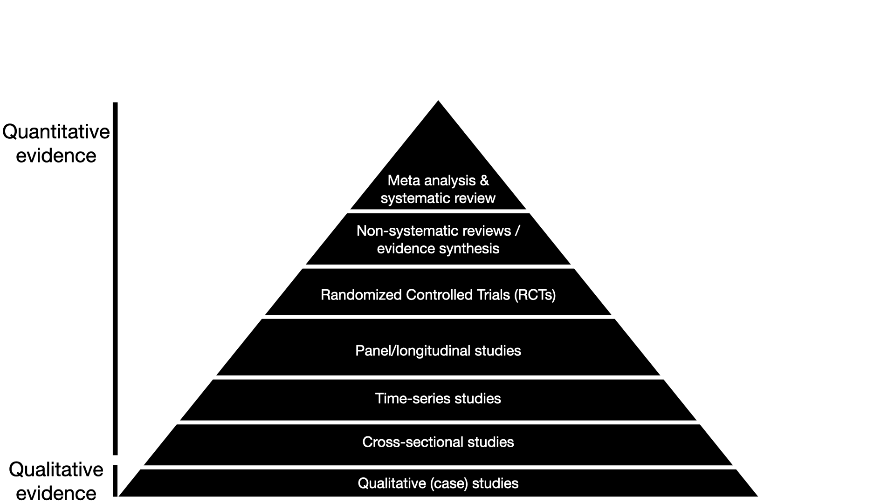
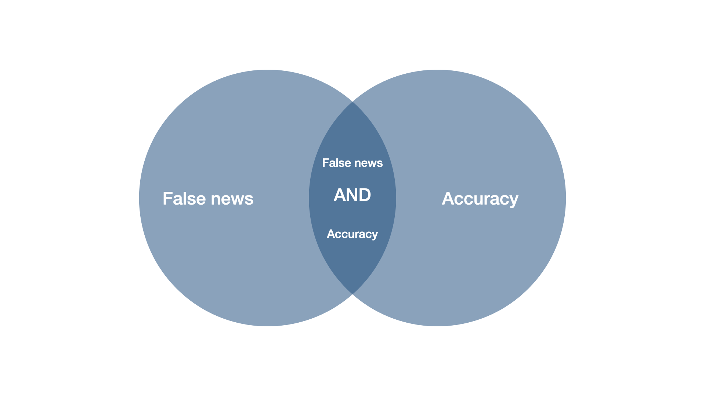
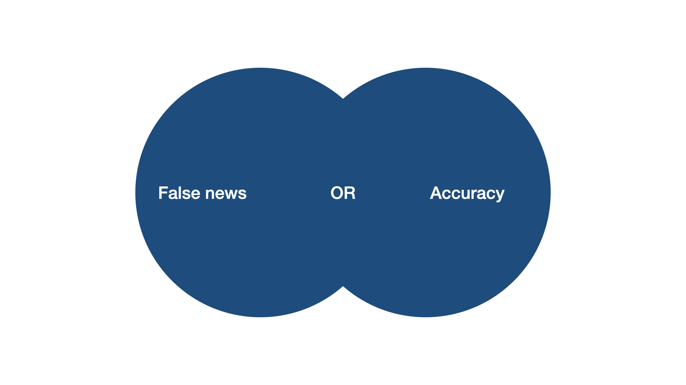
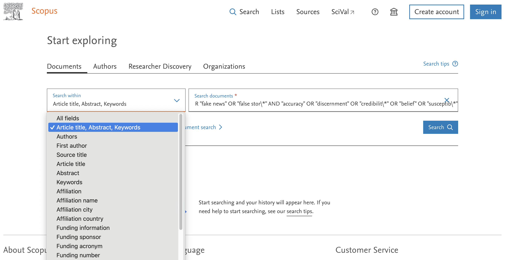
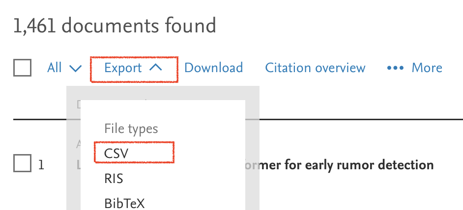

::: {.cell}

:::

::: {.cell}

:::


## Overview

::::: columns
::: {.column style="font-size: smaller;"}
1.  **Why meta-analyses**

2.  **The research question**

3.  **Effect Sizes**

4.  **Systematic literature search**

5.  **Running a meta-analysis**
:::

::: {.column style="font-size: smaller;"}

:::
:::::

# Why meta-analyses?

---

## (A typical textbook) pyramid of evidence

{.center width="100%"}

---

## Why are meta-analyses at the top of the pyramid?

-   Results of single studies are affected by many factors:

    -   the country
    -   experimental setup
    -   researchers
    -   sample demographics...

-   Averaging across many studies, we get a more robust, generalizable result

# The research question

---

## Case study: “Can people tell true news from false News ?”

>Pfänder, J., & Altay, S. (2025). Spotting false news and doubting true news: A systematic review and meta-analysis of news judgements. Nature Human Behaviour, 1–12. [https://doi.org/10.1038/s41562-024-02086-1](https://doi.org/10.1038/s41562-024-02086-1)

---

## Case study: “Can people tell true news from false News ?”

::::: columns
::: {.column width="50%"}

](images/example-item.jpg){fig-align="center" width="100%"}

:::

::: {.column width="50%"}
{width="100%"}
:::
:::::

---

## Define a quantifiable outcome

<br>

<br>

$$
\text{discernment} = \text{mean accuracy}_{\text{true news}} - \text{mean accuracy}_{\text{false news}}
$$

---

## Your turn: 


1. Download the data from:

>Lyons, B., Modirrousta-Galian, A., Altay, S., & Salovich, N. A. (2024). Reduce blind spots to improve news discernment? Performance feedback reduces overconfidence but does not improve subsequent discernment. https://doi.org/10.31219/osf.io/kgfrb 

[ `Lyons_2024.csv`](../data/Lyons_2024.csv)

2. Calculate a discernment score


::: {.cell}
::: {.cell-output-display}

```{=html}
<div class="countdown" id="timer_bc2ebf46" data-update-every="1" data-start-immediately="true" tabindex="0" style="right:0;bottom:0;font-size:1em;">
<div class="countdown-controls"><button class="countdown-bump-down">&minus;</button><button class="countdown-bump-up">&plus;</button></div>
<code class="countdown-time"><span class="countdown-digits minutes">05</span><span class="countdown-digits colon">:</span><span class="countdown-digits seconds">00</span></code>
</div>
```

:::
:::


---

## Solution {visibility="hidden"}


::: {.cell}

```{.r .cell-code}
lyons |> 
  group_by(veracity) |> 
  summarize(mean = mean(accuracy, na.rm = TRUE)) |> 
  pivot_wider(names_from = veracity, 
              values_from = mean) |> 
  mutate(discernment = true - fake)
```

::: {.cell-output .cell-output-stdout}

```
# A tibble: 1 × 3
   fake  true discernment
  <dbl> <dbl>       <dbl>
1  1.86  2.56       0.695
```


:::
:::


. . .

Is this score large? 


::: {.cell}

```{.r .cell-code}
table(lyons$scale)
```

::: {.cell-output .cell-output-stdout}

```

    4 
10671 
```


:::
:::


The study used a 4-point scale. On this scale, a value of 0.69 seems quite large. 


# Effect sizes

---

## What are effect sizes? 

In Meta-analyses not individual participants, but single studies are the unit of analysis

The outcomes of these studies are called "effect sizes".

](images/meta_level_analysis.png){fig-align="center" width="100%"}

---

## Your turn: 


1. Download the data from

>Allen, J., Arechar, A. A., Pennycook, G., & Rand, D. G. (2021). Scaling up fact-checking using the wisdom of crowds. Science Advances, 7(36), eabf4393.

[ `Allen_2021.csv`](../data/Allen_2021.csv)

2. Calculate the discernment score.

3. How does this compare to the other study? What issue are you seeing when you want to compare the two?


::: {.cell}
::: {.cell-output-display}

```{=html}
<div class="countdown" id="timer_32fbd785" data-update-every="1" data-start-immediately="true" tabindex="0" style="right:0;bottom:0;font-size:1em;">
<div class="countdown-controls"><button class="countdown-bump-down">&minus;</button><button class="countdown-bump-up">&plus;</button></div>
<code class="countdown-time"><span class="countdown-digits minutes">05</span><span class="countdown-digits colon">:</span><span class="countdown-digits seconds">00</span></code>
</div>
```

:::
:::


---

## Solution {visibility="hidden"}


::: {.cell}

```{.r .cell-code}
allen |> 
  group_by(veracity) |> 
  summarize(mean = mean(accuracy, na.rm = TRUE)) |> 
  pivot_wider(names_from = veracity, 
              values_from = mean) |> 
  mutate(discernment = true - fake)
```

::: {.cell-output .cell-output-stdout}

```
# A tibble: 1 × 3
   fake  true discernment
  <dbl> <dbl>       <dbl>
1  3.82  4.74       0.915
```


:::
:::


Check the scale


::: {.cell}

```{.r .cell-code}
unique(allen$scale)
```

::: {.cell-output .cell-output-stdout}

```
[1] "7"
```


:::
:::


The effect size is bigger than the one we found for Lyons 2024, but it is also measured on a broader 7-point scale.

This makes it impossible to immediately compare the effect sizes.

---

## Non-standardized effect sizes

<br>

...can only be directly interpreted on their original scales

<br>


::: {.cell}
::: {.cell-output-display}


|paper_id     |scale | fake| true| discernment|
|:------------|:-----|----:|----:|-----------:|
|Allen_2021   |7     | 3.82| 4.74|        0.92|
|Lyons_2024_b |4     | 1.86| 2.56|        0.69|


:::
:::


<br>

This is not great if we want to compare studies.

---

## Standardized effect sizes

<br>

... are not dependent on specific scales

<br>

They allow us to compare effects across studies that use different outcome measures.

---

## Cohen's d

<br>

- Perhaps the most popular standardized effect size when comparing two groups on a continuous outcome

<br>

- The idea is to express effect sizes in units of standard deviations

---

## Cohen's d

- If we plot the distribution of all individual accuracy ratings, we get something like below (slightly less perfect). 

- Cohen's d uses the standard devations of these distributions


::: {.cell}
::: {.cell-output-display}
{width=960}
:::
:::


---

## Cohen's d 

<br>

$$
\text{Cohen's d} = \frac{\bar{x}_{\text{true}} - \bar{x}_{\text{false}}}{SD_{\text{pooled}}}
$$ 

with

$$
SD_{\text{pooled}} = \sqrt{\frac{SD_{\text{true}}^2+SD_{\text{false}}^2}{2}}
$$

---

## Your turn: 

In which of the two studies did participants discern better? Calcuate Cohens' d for the two studies and compare. 


::: {.cell}
::: {.cell-output-display}

```{=html}
<div class="countdown" id="timer_0dc750c5" data-update-every="1" data-start-immediately="true" tabindex="0" style="right:0;bottom:0;font-size:1em;">
<div class="countdown-controls"><button class="countdown-bump-down">&minus;</button><button class="countdown-bump-up">&plus;</button></div>
<code class="countdown-time"><span class="countdown-digits minutes">05</span><span class="countdown-digits colon">:</span><span class="countdown-digits seconds">00</span></code>
</div>
```

:::
:::


---

## Solution {visibility="hidden"}


::: {.cell}

```{.r .cell-code}
pooled_sd <- function(sd_true, sd_false) {
  sd_pooled <- sqrt((sd_true^2 + sd_false^2) / 2)
  return(sd_pooled)
}

# Cohen's d for Allen_2021
allen_cohen_d <- allen |> 
  group_by(veracity) |> 
  summarize(mean = mean(accuracy, na.rm = TRUE), 
            sd = sd(accuracy, na.rm = TRUE)) |> 
  pivot_wider(names_from = veracity, 
              values_from = c(mean, sd)) |> 
  mutate(discernment = mean_true - mean_fake, 
         # calculate Cohen's d
         pooled_sd = pooled_sd(sd_true, sd_fake), 
         cohen_d = discernment/pooled_sd
         )

# Cohen's d for Lyons_2024
lyons_cohen_d <- lyons |> 
  group_by(veracity) |> 
  summarize(mean = mean(accuracy, na.rm = TRUE), 
            sd = sd(accuracy, na.rm = TRUE)) |> 
  pivot_wider(names_from = veracity, 
              values_from = c(mean, sd)) |> 
  mutate(discernment = mean_true - mean_fake, 
         # calculate Cohen's d
         pooled_sd = pooled_sd(sd_true, sd_fake), 
         cohen_d = discernment/pooled_sd
         )

# compare
lyons_cohen_d$cohen_d - allen_cohen_d$cohen_d 
```

::: {.cell-output .cell-output-stdout}

```
[1] 0.2769006
```


:::
:::


---

## Interpreting Cohen's d

"Participants in Lyons (2024) discerned better between true and false news than participants in Allen (2021), by 0.28 standard deviations"

. . .

Although widely used, this is not always easy to interpret. In psychology, as a rough guide for intepreting Cohen's d:

- small (0.2) < medium (0.5) < large (0.8)

(**but**: depends a lot on the discipline, research question etc.)

. . .

If you want to play around with the interpretation of Cohen's d, [check out this guide by Kristoffer Magnusson](https://rpsychologist.com/cohend/)


# Systematic literature review

---

::: {.callout-tip}

- Literature search something you do before calculating effect sizes, of course.

- But to do an effective literature search, you need to have an idea of what you are looking for.

- So, it makes sense to start thinking about the effect size you want to calculate before you do the literature search.

- In general, we will only very superficially talk about the literature search here.

:::

---

## The search string

Ideally, we want all studies that have ever been written on our research question. The more the better.

. . . 

But...

{width="70%"}

We often need to be specific in our search. 

---

## The search string

<br>

- When you start a meta-analysis, you often have at least a rough idea of what you are looking for/ have a paper that inspired your idea

- This gives you ideas of keywords that you could look for.

---

## The search string

This was our search string:

> '"false news" OR "fake news" OR "false stor\*" AND "accuracy" OR "discernment" OR "credibilit\*" OR "belief" OR "susceptib\*"'

. . .

:::: quiz
<i class="fa fa-question-circle quiz-icon"></i>

<div>

Would this search string have yielded a study called "News accuracy ratings of US adults during 2016 presidential elections"?

</div>
::::

. . . 

No, because of how boolean operators work. 

---

## Boolean operators

::::: columns
::: {.column width="50%"}
{width="100%"}
:::

::: {.column width="50%"}
{width="100%"}
:::
:::::

---

## Boolean operators

> '"false news" OR "fake news" OR "false stor\*" AND "accuracy" OR "discernment" OR "credibilit\*" OR "belief" OR "susceptib\*"'

<br>

- Our search string, put a bit more abstractly, reads ...OR...OR...AND...Or...OR... 

- As in math, there is a hierarchy among operators. 

- On Scopus (the search engine we used), [OR operators are treated before AND operators](https://schema.elsevier.com/dtds/document/bkapi/search/SCOPUSSearchTips.htm).

---

## Data bases

- Google Scholar -- great in most cases, but some disadvantages (e.g. user-specific results)

<br>

- There are many other data bases out there: 

  - Pubmed
  - Scopus
  - Web of Science
  - Your local university library catalogue
  - ...

---

## Data bases

Data bases allow very refined searches. 

::::: columns
::: {.column width="50%"}
{width="100%"}
:::

::: {.column width="50%"}
{width="100%"}
:::
:::::

---

## Data bases

Some databases also have features to export your search results as data sets. 

{width="50%"}


---

## Literature screening

There are several stages of deciding which studies to include:

1. Title screening (sort out titles that are obviously irrelevant)
2. Abstract screening 
3. Full-text screening

. . .

In particular in screening phases 2 and 3, all decisions are based on inclusion criteria (and must be documented!). 

For example, some of our inclusion criteria were: 

- english language
- a measure of accuracy for both true and false news
- real-world news items only

---

## PRISMA guidelines

<br>

- The whole point of a systematic search is to have an exhaustive and unbiased pool of studies. 

- We won't discuss the whole process here, but if you ever do a systematic review, you'll want to check out the [PRISMA guidelines](https://www.prisma-statement.org/) for systematic reviews and meta-analyses


# Running a meta-analysis

---

## The meta-analytic average

- A meta-analysis is basically taking an average of all effect sizes

](images/meta_level_analysis.png){fig-align="center" width="100%"}

---

## The meta-analytic average

<br>

...but not just a normal average - a weighted average. 

- The idea is that larger studies (with more participants/observations) are given more weight than smaller studies

- This is typically done via the standard error of the effect sizes

---

## Cohen's d (*part II*): the standard error

::: {.callout-tip}
Remember: 

The standard error is a special standard deviation - the standard deviation of the sampling distribution (i.e. the--hypothetical--distribution of estimates we would expect from drawing many different samples from a population). 
:::

---

## Cohen's d (*part II*): the standard error

<br>

$$
SE_{\text{Cohen's d}} = \sqrt{ \frac{n_\text{true} + n_\text{false}}{n_\text{true} n_\text{false}} + \frac{d^2}{2(n_\text{true} + n_\text{false})} }
$$

- $d$ = Cohen's d
- $n_\text{false}$ =  sample size of fake news items, 
- $n_\text{true}$ = sample size of true news items, 
- and $SD_{\text{pooled}}$ the **pooled standard deviation** of both groups (see above).

. . .

::: {.callout-tip}
All you need to remember: 

With greater sample size, smaller standard error (this should ring a bell from our class on statistical power).
:::

---

Your turn: 

Imagine you collected data from 9 studies

1. Download the meta-analysis data [ `meta_analysis_news.csv`](../data/meta_analysis_news.csv).

2. Calculate Cohen's d and its standard error (you can use this function which translates the previous formula into R code):


::: {.cell}

:::

::: {.cell}
::: {.cell-output-display}

```{=html}
<div class="countdown" id="timer_692facdb" data-update-every="1" data-start-immediately="true" tabindex="0" style="right:0;bottom:0;font-size:1em;">
<div class="countdown-controls"><button class="countdown-bump-down">&minus;</button><button class="countdown-bump-up">&plus;</button></div>
<code class="countdown-time"><span class="countdown-digits minutes">05</span><span class="countdown-digits colon">:</span><span class="countdown-digits seconds">00</span></code>
</div>
```

:::
:::


---

## Solution {visibility="hidden"}


::: {.cell}

```{.r .cell-code}
# Function to calculate pooled standard deviation
pooled_sd <- function(sd_true, sd_false) {
  sd_pooled <- sqrt((sd_true^2 + sd_false^2) / 2)
  return(sd_pooled)
}

# Function to calculate standard error of Cohen's d
se_cohen_d <- function(d, n1, n2) {
  se_d <- sqrt((n1 + n2) / (n1 * n2) + (d^2) / (2 * (n1 + n2)))
  return(se_d)
}

meta_summary <- meta_summary |> 
  mutate(pooled_sd = pooled_sd(sd_true, sd_fake), 
         cohen_d = discernment/pooled_sd, 
         se_cohen_d = se_cohen_d(cohen_d, n_ratings_true, n_ratings_fake)
         )
```
:::


---

## Calculate weigths 

<br>

As noted earlier, the standard error helps us calculate a weight for each study $k$ in our meta-analysis: 

$$
w_k = \frac{1}{se^2_k}
$$

- $se^2$ = squared standard error (also called variance) of a study $k$

::: {.callout-tip}
Note: 

The bigger the sample size, the smaller the standard error, the greater the weight. 
:::

---

## Calculate the meta-analytic average

<br>

Based on the standardized effect sizes and their standard errors, we can finally calculate the meta-analytic average.

$$
\hat\theta = \frac{\sum^{K}_{k=1} \hat\theta_kw_k}{\sum^{K}_{k=1} w_k}
$$

- $\hat\theta$ = estimate of the meta-analytic average

---

## The meta-analytic average

<br>

In practice, you'll always use existing R packages for these calculations. 

There are many packages out there, but a popular one is the [`metafor`](https://www.metafor-project.org/doku.php/metafor) package

---

## Your turn: 

Can people discern between true and false news? Use the metafor package and its [`rma.uni()`](https://wviechtb.github.io/metafor/reference/rma.uni.html) function (check documentation by clicking on the function) to calculate the meta-analytic average. 

::: {.callout-tip}

- you don't need to specify the `weights` arguments

- you only need to specify `yi`, `sei` and `data`

:::


::: {.cell}
::: {.cell-output-display}

```{=html}
<div class="countdown" id="timer_df3d8eca" data-update-every="1" data-start-immediately="true" tabindex="0" style="right:0;bottom:0;font-size:1em;">
<div class="countdown-controls"><button class="countdown-bump-down">&minus;</button><button class="countdown-bump-up">&plus;</button></div>
<code class="countdown-time"><span class="countdown-digits minutes">05</span><span class="countdown-digits colon">:</span><span class="countdown-digits seconds">00</span></code>
</div>
```

:::
:::


---

## Solution {visibility="hidden"}


::: {.cell}

```{.r .cell-code}
library(metafor)

meta_model <- rma.uni(yi = cohen_d, sei = se_cohen_d, data = meta_summary)

summary(meta_model)
```

::: {.cell-output .cell-output-stdout}

```

Random-Effects Model (k = 8; tau^2 estimator: REML)

  logLik  deviance       AIC       BIC      AICc   
 -0.8852    1.7704    5.7704    5.6622    8.7704   

tau^2 (estimated amount of total heterogeneity): 0.0748 (SE = 0.0402)
tau (square root of estimated tau^2 value):      0.2735
I^2 (total heterogeneity / total variability):   99.79%
H^2 (total variability / sampling variability):  475.36

Test for Heterogeneity:
Q(df = 7) = 3115.1291, p-val < .0001

Model Results:

estimate      se    zval    pval   ci.lb   ci.ub      
  0.8318  0.0970  8.5780  <.0001  0.6418  1.0219  *** 

---
Signif. codes:  0 '***' 0.001 '**' 0.01 '*' 0.05 '.' 0.1 ' ' 1
```


:::
:::


---

## Forest plot


::: {.cell}
::: {.cell-output-display}
{width=960}
:::
:::


# Things we couldn't cover (but you should know are possible)

---

- There are many other standardized effect sizes for different variably types 

- We have only discussed fixed effects meta-analyses. Yet, for some research questions and data types, it is better to use slightly more complex, random effects meta-analyses 

- To test the effect of context factors, you can also run so called "meta-regressions"

- Meta-analyses can reveal publication bias or p-hacking (see our class the replication crisis). Meta-analyses typically include several tests that can be indicative of this 


